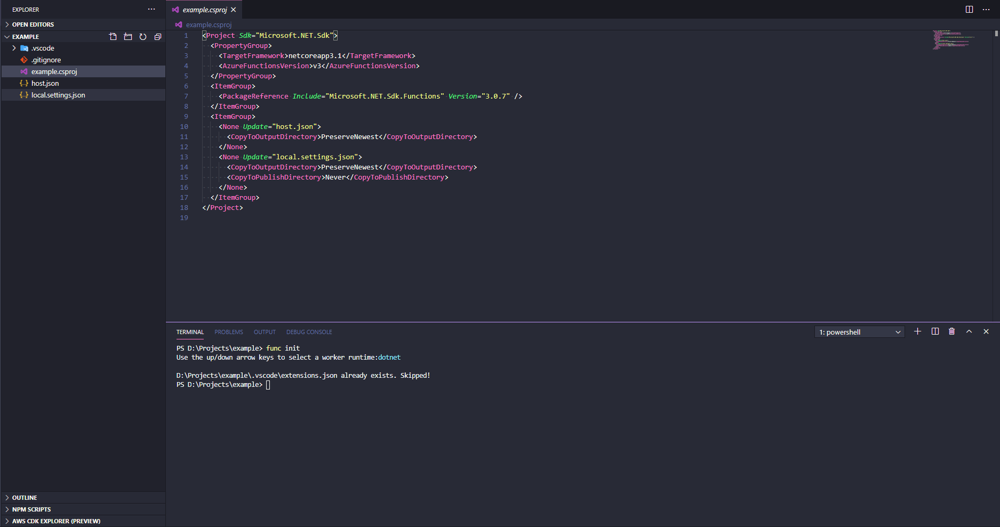
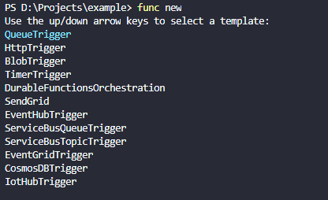
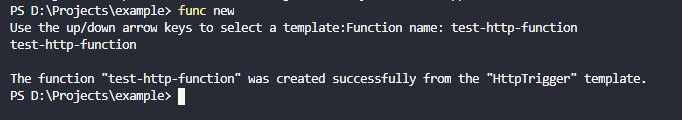
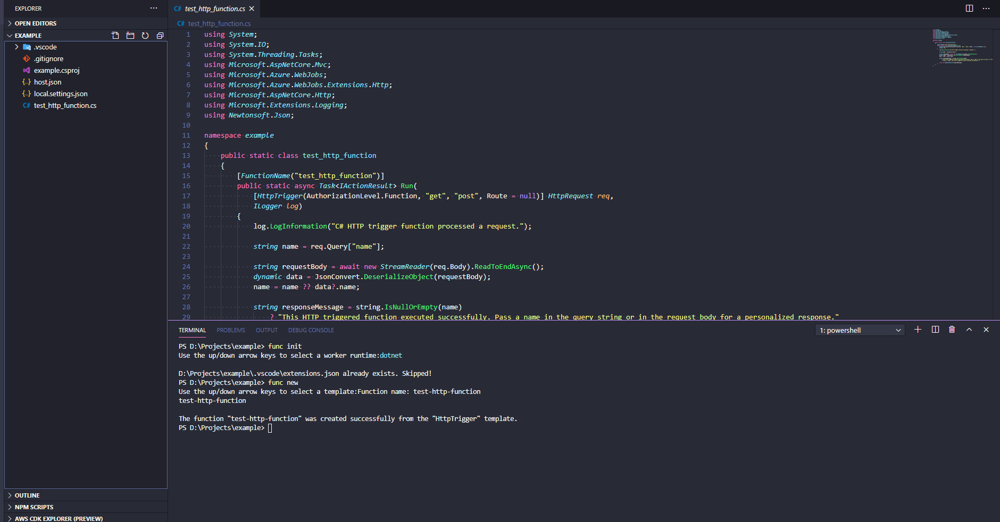
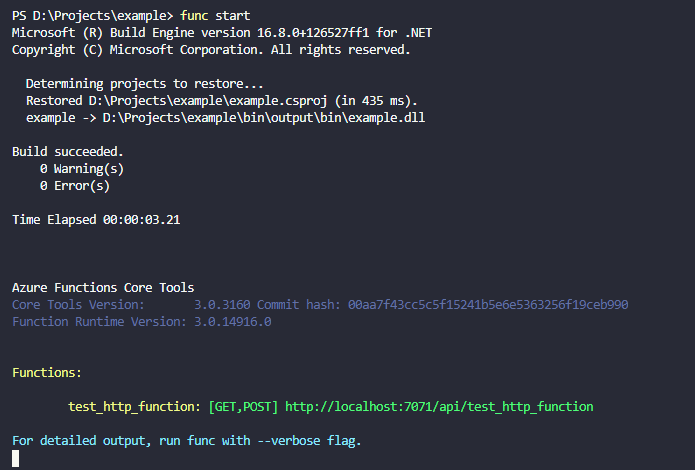

# Azure Function

## Local Development

### Create New Functions Project

```bash
func init
```

**Result**




::: tip
This result from version 3 of Azure Function Core Tools. Sometimes will different result, please find another reference for your installed CLI if have difference.
:::

### Create New Function

```bash
func new
```

**Result**







::: tip
This result from version 3 of Azure Function Core Tools. Sometimes will different result, please find another reference for your installed CLI if have difference.
:::

### Running Functions Locally

```bash
func start
```

**Result**



::: tip
This result from version 3 of Azure Function Core Tools. Sometimes will different result, please find another reference for your installed CLI if have difference. Also keep in mind, this result maybe different for another language. The current project use dotnet.
:::

### Publish to Azure

```bash
func azure functionapp publish <app_name>
```

::: tip
`<app_name>` is the name of the target function app in Azure, not the name of your project folder, which can be different.
:::

## Deployment

### Create Function App

```bash
az functionapp create \
  --resource-group "$RESOURCEGROUP" \
  --name "$FUNCTIONAPP" \
  --storage-account "$STORAGEACCT" \
  --runtime node \
  --consumption-plan-location centralus \
  --functions-version 2
```
